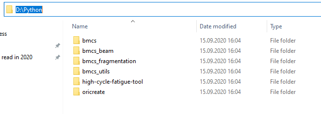

## Instructions for adding custom Python packages to Anaconda environment path

### Why?

For using common Python packages like numpy, it's enough to install the package and then you can use
`import numpy as np`
to use it in any Python module.

However, to use custom Python packages in a Python module that is located outside the package directory, you need to add the path of this package to your Python environment.
 

### How?

If Anaconda is used as the Python environment perform the following command in the Anaconda Prompt:\
`conda-develop /path/to/my_python_packages`

_How it works?_\
This command will simply add the file `"USER_HOME_DIRECTORY\Anaconda3\Lib\site-packages\conda.pth"` which contains the paths.

### Example

* We have the following custom Python packages:

* The following command is excuted
`conda-develop D:\Python`

* Now it's possible to import any module from these custom packages in any external Python module such as `from bmcs_utils.api import IPWInteract`

**Note for PyCharm:**\
Now as long as you're using the Python interpreter that comes with Anaconda environment 
within your PyCharm project, you should be able to import your packages.

